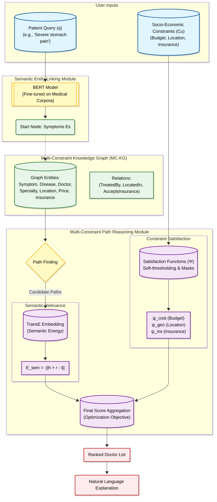

# **Neuro-Symbolic Path Reasoning (NSPR) for Explainable Physician Recommendation**

This repository contains the implementation of the **Neuro-Symbolic Path Reasoning (NSPR)** framework, as proposed in the paper *"Neuro-Symbolic Path Reasoning for Explainable Doctor Recommendation: Integrating Medical Knowledge with Socio-Economic Constraints"*.

## **Overview**

The NSPR framework addresses the challenge of matching patients to doctors by bridging the semantic gap between patient complaints and medical terminology while strictly adhering to socio-economic constraints (Budget, Location, Insurance).

### **Key Features**

* **Multi-Constraint Knowledge Graph (MC-KG):** Integrates medical entities (Symptoms, Diseases) with constraint entities (Price, Location).  
* **Neuro-Symbolic Reasoning:** Combines neural embeddings (TransE) with symbolic path reasoning.  
* **Constraint-Aware Scoring:** Optimization function $\\Psi$ that balances semantic relevance with financial and geographical feasibility.  
* **Explainability:** Generates natural language explanations for every recommendation.

### **Architecture**


## **Repository Structure**
```
├── data/  
│   ├── symptoms.json      \# List of symptoms  
│   ├── diseases.json      \# Mapping of diseases to symptoms and specialties  
│   └── doctors.json       \# Doctor profiles with attributes (fee, location, etc.)  
├── main.py                \# Entry point: Loads data and runs the demo  
├── nspr\_model.py          \# Core logic: Graph construction, Path Finding, Scoring  
├── requirements.txt       \# Python dependencies  
└── README.md              \# Project documentation
```

## **Data Description**

The system uses JSON files to construct the Knowledge Graph dynamically. You can modify these files to test different scenarios.

* **symptoms.json**: Defines the entry points for patient queries.  
* **diseases.json**: Links symptoms to diseases and required medical specialties.  
* **doctors.json**: Contains provider details including socio-economic attributes (fees, insurance, coordinates).

## **Installation**

1. Clone the repository:  
```
git clone https://github.com/tanhaei/NSPR-KG-subset.git
cd nspr-doctor-recommendation
```
2. Install dependencies:  
```
pip install -r requirements.txt
```

## **Usage**

Ensure the data/ folder contains the necessary JSON files, then run:
```
python main.py
```

### **Expected Output**

The script will:

1. Load entities and relations from the data/ directory.  
2. Construct the Multi-Constraint Knowledge Graph (MC-KG).  
3. Simulate a patient query (defined in main.py).  
4. Rank doctors using the NSPR scoring algorithm.  
5. Output the top recommendation with a generated natural language explanation.

## **Methodology**

The scoring function implemented is based on Equation 6 from the paper:

$$ Score(e\_d) \= \\Psi(e\_d, \\mathcal{C}*u) \\cdot \\sum*{\\rho \\in \\mathcal{P}*{s \\to d}} \\frac{\\exp(E*{sem}(\\rho))}{\\sum\_{\\rho'} \\exp(E\_{sem}(\\rho'))} $$

Where $\\Psi$ represents the satisfaction of socio-economic constraints (Cost, Distance, Insurance).

## **Citation**

If you use this code, please cite the original paper:

## **License**

MIT
